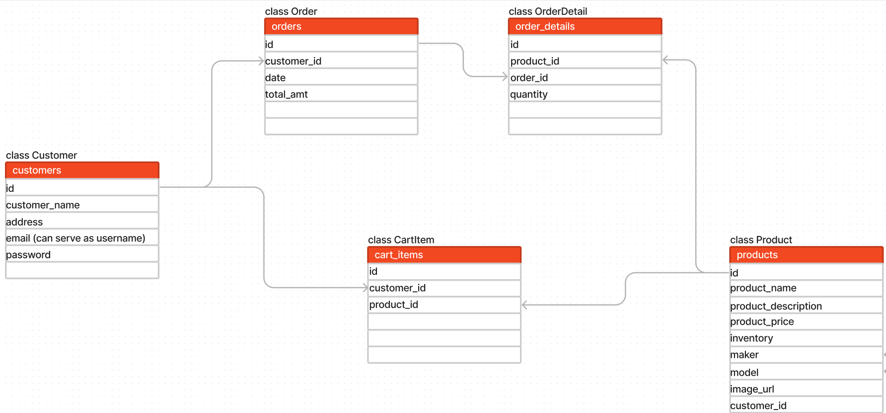

# ⌚ WatchList
Hello and welcome! This is a fullstack ecommerce application for manual & automatic watches, implementing React for the frontend and Python & Flask + SQLAlchemy for the backend. This README will give an overview of the server-side, and getting the backend up & running in the terminal(s). For an overview of the client-side, please go [here](/client/README.md).

## Filesystem
```
.
├── CONTRIBUTING.md
├── LICENSE.md
├── README.md
├── Pipfile
├── Pipfile.lock
├── client
│   ├── README.md
│   ├── node_modules
│   ├── package-lock.json
│   ├── package.json
│   ├── public
│   └── src
│       ├── components
│       └── context
└── server
    ├── app.py
    ├── config.py
    ├── migrations
    ├── models.py
    └── seed.py
```

## Install dependencies
* Fork and clone this repo from Github to your local environment
* Move to your local base directory and open the terminal in your code editor
* Run ```pipenv install``` to install dependencies
* Run ```pipenv shell``` to create and enter your virtual environment
* ```cd server``` to enter the server directory


## Generate the Database


To setup your database, do the following:
* make sure that you are in the `server/` directory and run ```export FLASK_APP=app.py``` to specify how to load the application
* run ```flask db init```
* run `flask db migrate -m "your message"`
* run ```flask db upgrade```
* run ```python seed.py``` to seed the database

> **Tip: It's always a good idea to start with an empty revision! This allows
> you to roll all the way back while still holding onto your database. You can
> create this empty revision with `flask db revision -m'Create DB'`.**

## Running the flask server
In a new terminal, run ```pipenv shell``` and, after making sure that you ```cd``` into the /server directory, run ```flask run``` to get the backend server up & running

## Start the Development (Client) Server
For an overview of the client-side, please go [here](/client/README.md)

> **TIP: It's good practice to have the backend server running first!**

## Packages Used
* Server-side:
    * faker
    * flask
        * flask-migrate
        * flask-sqlalchemy
        * flask-cors
        * flask-restful
        * flask-bcrypt
    * sqlalchemy
    * sqlalchemy-serializer
    * requests

## Resources & Acknowledgements
- This project was bootstrapped with [Create React App](https://github.com/facebook/create-react-app).
- Watches used for this app were sourced from the following sites:
    - [TeddyBaldassarre Watch Blog](https://teddybaldassarre.com/blogs/watches/best-mechanical-watches)
    - [FratelloWatches](https://www.fratellowatches.com/the-classic-time-only-manual-wind-watch-examples-for-every-budget-from-hamilton-grand-seiko-omega-and-more/#gref)
    - [SaksFifthAvenue](https://www.saksfifthavenue.com/product/Oris-Big-Crown-ProPilot-X-Calibre-115-0400018040529.html?site_refer=CSE_GGLPLA:Mens_Jewelry:Oris&country=US&currency=USD&CSE_CID=G_Saks_PLA_US_Men%27s+Accessories:Jewelry&gclid=Cj0KCQjwqs6lBhCxARIsAG8YcDgMEXcUM_GlruGn-SXkRDlKIEM3bwmDQAUn56LscIl3iUt9qcR4Le4aAtONEALw_wcB&gclsrc=aw.ds)
    - [TwoBrokeWatchSnobs](https://twobrokewatchsnobs.com/best-automatic-watches/)
- [Chatengine.io](https://chatengine.io/)
- [Material UI](https://mui.com/)
- [React documentation](https://react.dev/)
- [Python documentation](https://docs.python.org/3/)
- [Flask documentation](https://stackabuse.com/python-circular-imports/)
- [SQLAlchemy documentation](https://docs.sqlalchemy.org/en/20/)
- [Flask-SQLAlchemy documentation](https://flask-sqlalchemy.palletsprojects.com/en/3.0.x/)
