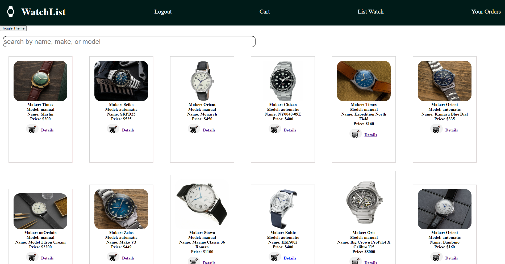

# ⌚ WatchList
Hello and welcome! This is a fullstack ecommerce application for manual & automatic watches, implementing React for the frontend and Python & Flask + SQLAlchemy for the backend. This README will give an overview of the client-side, and getting the frontend up & running in the terminal(s). For an overview of the client-side, please go [here](/README.md).



## Features
* Create an Account as a Customer
* Login/Logout: User Authentication
* Browse through a plethora of watch products
* Add to Cart ➡️ Checkout ➡️ Order History
* Check for more details on a specific watch
* Toggle Dark/Light mode
* Basic Chat

## Start the Backend Server First
For an overview of the server-side, please go [here](/README.md)

## Start the Development (Client) Server
To start running the client, do the following:
* open a separate terminal, ```cd``` into the client directory
* run ```npm install``` to install dependencies
* run ```npm start``` to open the app in the browser

## Packages Used
* Client-side:
    * MUI
        * @emotion/react
        * @emotion/styled
        * @mui/icons-material
        * @mui/material
    * React.js
        * react-dom
        * react-router-dom
    * formik
    * yup

## Resources & Acknowledgements
- This project was bootstrapped with [Create React App](https://github.com/facebook/create-react-app).
- Watches used for this app were sourced from the following sites:
    - [TeddyBaldassarre Watch Blog](https://teddybaldassarre.com/blogs/watches/best-mechanical-watches)
    - [FratelloWatches](https://www.fratellowatches.com/the-classic-time-only-manual-wind-watch-examples-for-every-budget-from-hamilton-grand-seiko-omega-and-more/#gref)
    - [SaksFifthAvenue](https://www.saksfifthavenue.com/product/Oris-Big-Crown-ProPilot-X-Calibre-115-0400018040529.html?site_refer=CSE_GGLPLA:Mens_Jewelry:Oris&country=US&currency=USD&CSE_CID=G_Saks_PLA_US_Men%27s+Accessories:Jewelry&gclid=Cj0KCQjwqs6lBhCxARIsAG8YcDgMEXcUM_GlruGn-SXkRDlKIEM3bwmDQAUn56LscIl3iUt9qcR4Le4aAtONEALw_wcB&gclsrc=aw.ds)
    - [TwoBrokeWatchSnobs](https://twobrokewatchsnobs.com/best-automatic-watches/)
- [Chatengine.io](https://chatengine.io/)
- [Material UI](https://mui.com/)
- [React documentation](https://react.dev/)
- [Python documentation](https://docs.python.org/3/)
- [Flask documentation](https://stackabuse.com/python-circular-imports/)
- [SQLAlchemy documentation](https://docs.sqlalchemy.org/en/20/)
- [Flask-SQLAlchemy documentation](https://flask-sqlalchemy.palletsprojects.com/en/3.0.x/)
